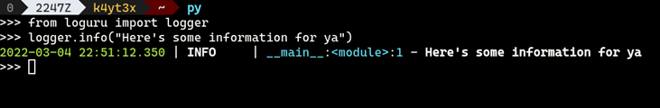
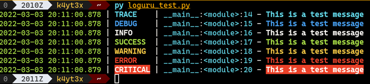
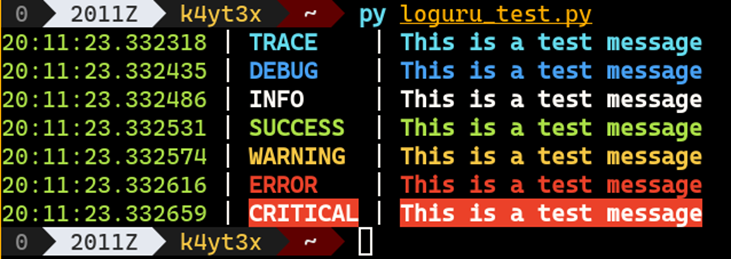
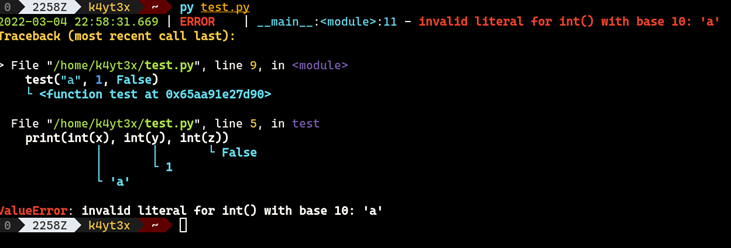

# Printing and Logging
Programs often need to write some messages to the console or a log file to show the program’s progress, current state, and error information. There are many caveats to printing messages in Python. This page covers the basics of message printing and logging.

## Table of Contents
- [Printing](#PrintingandLogging-Printing)
- [Standard Library: logging](#PrintingandLogging-StandardLibrary:logg)
- [Third-Party Library: Loguru](#PrintingandLogging-Third-PartyLibrary:L)

## Printing
As you already know, you can use the `print()` function to print stuff onto the screen. `print` writes the messages to STDOUT (standard output) by default.
If you'd like to use `print` statements in production, make sure you are writing your messages to the right place. Normal program output should be written to STDOUT, while warning messages and error messages should be written to STDERR.
You can do it by specifying `print's` output file.
```python
import sys
print("Fetching data from Redis")
print("Error: Could not connect to Redis", file=sys.stdout)
```

You might need to include variables' contents in a message. You can do this by formatting the variable into a string.
This can be done in several ways. Here are two recommended methods: format string and f-string.
```python
number = 0
print("The number is: {}".format(number))
print(f"The number is: {number}")
```

There are also advanced ways of using these formatting functions. For instance, this following code rounds the number `10.12345`
to two decimal places, centers it in 20 characters, and fills the spaces with `xs`.
Refer to [the documentation](https://docs.python.org/3/tutorial/inputoutput.html) for more information on the advanced usages.
```python
>>> print("{:x^20.2f}".format(10.12345))
xxxxxxx10.12xxxxxxxx
>>> print(f"{10.12345:x^20.2f}")
xxxxxxx10.12xxxxxxxx
```

## Standard Library: [logging](https://docs.python.org/3/library/logging.html)
`logging` is one of Python’s standard libraries. It contains most of the basic functions you would want in a logger.
Basic logging with `logging` looks something like this:
```python
import logging
logging.info("Here's some information for ya")
```

You can also customize the logger’s format, level, etc.:
```python
import logging
logging.basicConfig(format="%(asctime)s %(message)s", level=logging.DEBUG)
logging.info("Here's some more info")
```

`logging` supports five logging levels:

| Level name | Logger method        |
|------------|----------------------|
| DEBUG      | `logging.debug()`    |
| INFO       | `logging.info()`     |
| WARNING    | `logging.warning()`  |
| ERROR      | `logging.error()`    |
| CRITICAL   | `logging.critical()` |

Python’s official documentation already contains a very detailed page on how to use the logging library.
Refer to `logging`'s [documentation](https://docs.python.org/3/howto/logging.html) for more advanced usages.

## Third-Party Library: [Loguru](https://loguru.readthedocs.io/en/stable/api/logger.html)
Loguru is a third-party library that contains a lot of extra fancy features than `logging`.
It is not the only option out there, but it is a compelling one and is easy to set up and use.
If you don’t want to do anything fancy, this following snippet is all you need to get started:
```python
from loguru import logger
logger.info("Here's some information for ya")
```

This code will produce the following output. Loguru will write the output to the correct output stream according to its level.



Below are the logging levels supported by Loguru:

| Level name | Severity value | Logger method       |
|------------|----------------|---------------------|
| TRACE      | 5              | `logger.trace()`    |
| DEBUG      | 10             | `logger.debug()`    |
| INFO       | 20             | `logger.info()`     |
| SUCCESS    | 25             | `logger.success()`  |
| WARNING    | 30             | `logger.warning()`  |
| ERROR      | 40             | `logger.error()`    |
| CRITICAL   | 50             | `logger.critical()` |

The logger’s default format is:
```python
LOGURU_FORMAT = env(
    "LOGURU_FORMAT",
    str,
    "<green>{time:YYYY-MM-DD HH:mm:ss.SSS}</green> "
    "<level>{level: <8}</level> "
    "<cyan>{name}</cyan>:<cyan>{function}</cyan>:<cyan>{line}</cyan> - <level>{message}</level>",
)
```

By default, the logs look something like this:



You can configure the format and color of the messages.
The default format is too verbose for me, so I normally use this custom format that is more concise:
```python
LOGURU_FORMAT = (
    "<green>{time:HH:mm:ss.SSSSSS!UTC}</green> "
    "<level>{level: <8}</level> "
    "<level>{message}</level>"
)
logger.remove()
logger.add(sys.stderr, colorize=True, format=LOGURU_FORMAT)
```

The output will look something like this:



Loguru also has some other useful features and functions like `logger.exception()`.
It formats the exception messages into something easier to read – colorizing the output and labeling the variables' values:



For more information, you guessed what I’m about to say: go to [Loguru’s documentation](https://loguru.readthedocs.io/en/stable/api/logger.html).
