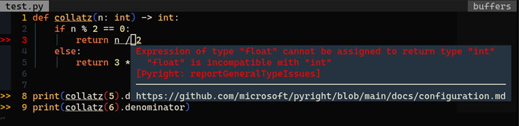

# Typing and Type Hints (PEP 484)

## Table of Contents
- [Functions](#TypingandTypeHints(PEP484)-Functions)
- [Variables](#TypingandTypeHints(PEP484)-Variables)
- [typing Module](#TypingandTypeHints(PEP484)-typingModule)

## Introduction
Python, as a dynamic interpreted language, is weakly-typed. Python's linters like Flake8 and Pylint can hardly predict the types of variables before the code is executed.
In contrast, languages like Rust and Golang are more strongly typed. An editor with rust-analyzer support can continuously check for typing errors while the user is editing the code.
The code also doesn't compile if there are type mismatches.
Consequently, Python programs are naturally more likely to contain typing errors since there aren't any compilers that can check for the variables' types.
These errors and mistakes tend to only surface when the program is executed and even put in production. It is, therefore, sometimes very time-consuming and frustrating to debug type-related bugs in Python.
Type hints were proposed in PEP 484 and can help mitigate this issue. Type hints allow users to declare a variable's type or a function's return type.
This will allow users of a library to more easily understand what should be passed to a function or to understand what a variable's type should be. Linters and IDEs can now also interpret these types and warn users about type mismatches.

For instance, consider the following code:
```python
def collatz(n):
    if n % 2 == 0:
        return n / 2
    else:
        return 3 * n + 1

print(collatz(5).denominator)
print(collatz(6).denominator)
```

Without type hints, this function might appear just fine to the programmer. However, when it is executed, an error will be thrown because while `3 * n + 1` returns an `int`, `n / 2` returns a `float`. `int` has the attribute `denominator`, but `float` doesn't.
```bash
$ python test.py
1
Traceback (most recent call last):
  File "/home/user/test.py", line 9, in <module>
    print(collatz(6).denominator)
AttributeError: 'float' object has no attribute 'denominator'
```

We can use type hints to annotate the types of the function's parameters and the function's return type so the linter can automatically check for errors and highlight them in the editor.
```python
def collatz(n: int) -> int:
    if n % 2 == 0:
        return n / 2
    else:
        return 3 * n + 1

print(collatz(5).denominator)
print(collatz(6).denominator)
```

Now the editor will show a warning that there's a mismatch between the desired return type and the actual value returned:


## Functions
Function type hints' syntax is as follows:
```python
def function(param: [type]) -> [return_type]:
    ...
```

For example:
```python
import pathlib

def delete_file(path: pathlib.Path) -> int:
    """
    delete the path if it is a file
    :param path pathlib.Path: path of the file
    :rtype int: 0 if the file exists and is deleted, else 1
    """
    if path.is_file():
        path.unlink()
        return 0
    return 1
```

## Variables
Variable type hints' syntax is as follows:
```python
[variable]: [type] = [value]
```

For example:
```python
import queue

item: int = 1
some_queue: queue.Queue[int] = queue.Queue()
some_queue.put(item)
```

## __typing__ Module
Python introduced the typing module in order to support more sophisticated type hints. For example, if you'd like to say “an instance of either of these three classes,” you can write:
```python
from typing import Type, Union

def func(param: Type[Union[ClassA, ClassB]]) -> None:
    ...
```

You can also write it like:
```python
from typing import Type, Union

def func(param: Union[Type[ClassA], Type[ClassB]]) -> None:
    ...
```

Go to the [official documentation](https://docs.python.org/3/library/typing.html) for more information on how to use the typing module. I don't want to copy & paste their entire page here. 😛
