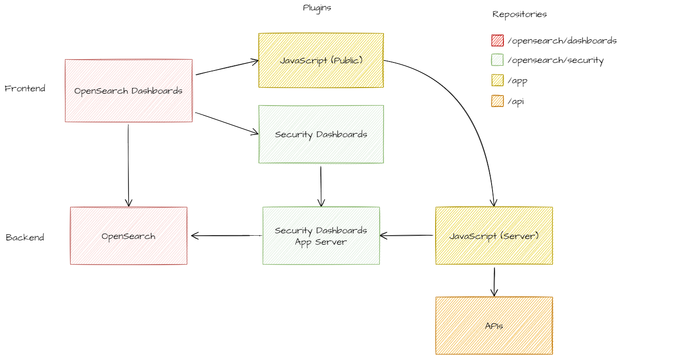

## Context
It is about when we need to develop a plugin for the Open Search app (we call it OSD, which is an open source version of Kibana + Elasticsearch).
And, in this article we have some instructions how to deal with the plugin environment, to be able to start this development.

## Repositories
1. OpenSearch Dashboards: https://github.com/opensearch-project/OpenSearch-Dashboards
2. OpenSearch Dashboards Security Plugin: https://github.com/opensearch-project/security-dashboards-plugin
3. Plugin: https://xpto.com/xpto
4. API: https://xpto.com/xpto
5. Dev CLI: https://xpto.com/xpto

## Dependencies

### Base Stack
As shown above, our base stack is OpenSearch and OpenSearch Dashboards, witch are equivalent for ElasticSearch and Kibana, respectively.

* We run the [OpenSearch server in containers](https://opensearch.org/downloads.html), orchestrated by a Docker Compose file that is configured inside the OpenSearch Dashboard project.
* The OpenSearch Dashboards (it's a fork of Elasticsearch, maintained by AWS) has dependency on our custom plugins and can be started by following some simple steps described on it’s `CONTRIBUTING_PROPRIETARY` file.

### Plugins
It’s important to notice that the OpenSearch Dashboard plugins are "full-stack" plugins, since they can have a frontend and backend, inside the `/public` and `/server` sub-folders respectively.

* The plugin is our main frontend application, and it’s setup is described on the `README.md` file.
It depends on the OSD Security plugin on the backend, for getting user information, before we forward the requests to our APIs.
* The Security Dashboards plugin is used to provide authentication and authorization for the application.

### APIs
Our main backend service, that provides all the functionality for our app.
The project runs in containers managed by Docker Compose that loads an API, database and queue services.

### Dev CLI
We use this project to build our development stack and populate our APIs.
