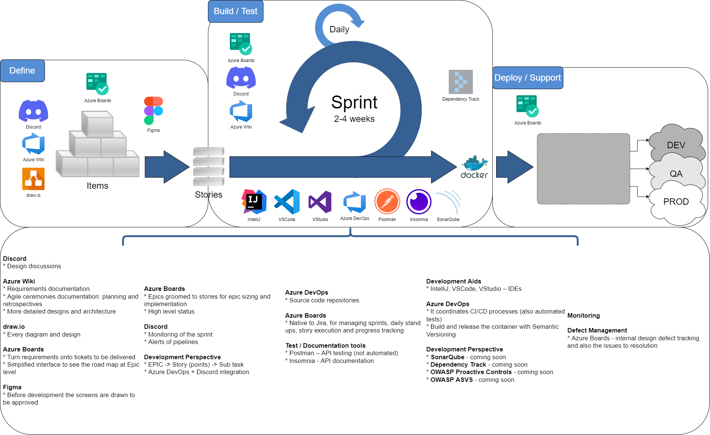

# Development Life Cycle

> **TL;DR:** This section covers the end-to-end development life cycle, including Git workflow, architecture standards, testing practices, CI/CD pipelines, and security guidelines.

## Overview

This document provides a high-level view of the development life cycle adopted by the team. Each phase is covered in detail in the sub-pages listed below.

## Flow View

## Topics

- [Git Flow](Life-Cycle/Git-Flow.md) -- Branching strategy, commit conventions, semantic versioning
- [Architecture](Life-Cycle/Architecture.md) -- Clean Architecture principles and SOLID
- [Backend Design](Life-Cycle/Architecture/Backend-Design.md) -- Layers, flows, and dependency injection
- [Frontend Design](Life-Cycle/Architecture/Frontend-Design.md) -- 5-layer frontend architecture
- [Testing](Life-Cycle/Tests.md) -- Test standards, doubles, and builders
- [CI/CD](Life-Cycle/CI-&-CD.md) -- Pipeline stages and best practices
- [Security](Life-Cycle/Security.md) -- OWASP-based security practices
- [Documentation & Change Control](Life-Cycle/Documentation-&-Change-Control.md) -- Changelog, README, and AI instruction maintenance
