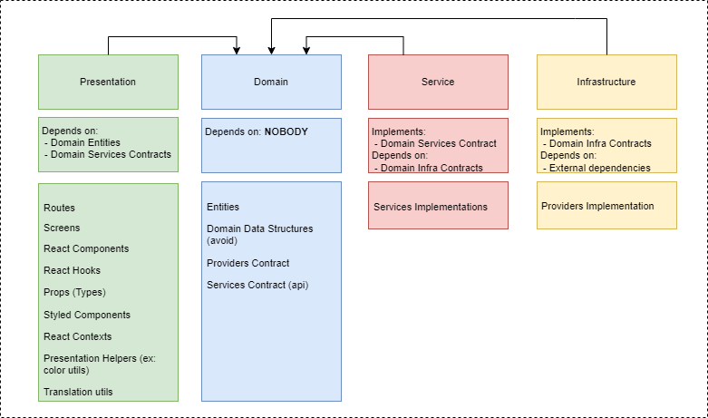

## Concepts

### Layers
As a lightweight approach of the Clean Architecture, the Front End is currently divided into 5 layers:

1. **Domain:** The most abstract layer, defines the Entities and Contracts for the other layers.
2. **Service:**  This layer provides communication with APIs and external services.
3. **Infrastructure:** This layer provides implementations of technology-specific interfaces.
4. **Presentation:** This layer contains all the code that will draw the views.
5. **Main Layer:** This is the “dirt” layer. It has the responsibility of instantiating the Providers and Services and handling all the Dependency Injections.

A visual representation of each layer and its dependencies:

Applying the architecture to the Feature Modules system:

This way, the dependencies are always pointing to the Domain, which is the most abstract and stable layer.

Obs. At the moment, there’s no State Layer, since we’re always handling state locally inside the components (Presentation). In the future, that would be necessary to update this structure adding support to it.

## References:

* [A different approach to frontend architecture](https://dev.to/huytaquoc/a-different-approach-to-frontend-architecture-38d4)
* [Scalable Frontend #1 — Architecture Fundamentals | The Miners](https://blog.codeminer42.com/scalable-frontend-1-architecture-9b80a16b8ec7/)
* [Clean architecture for the rest of us](https://pusher.com/tutorials/clean-architecture-introduction/)
