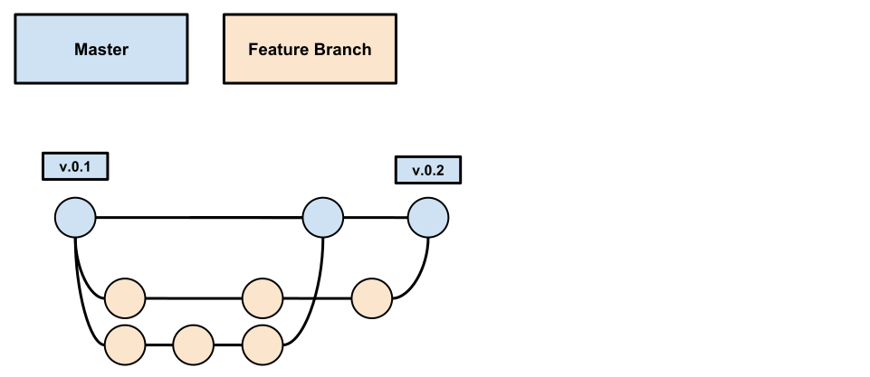

# Git Flow

> **TL;DR:** Use a feature-branch model with `main` always deployable. Synchronize branches with `git rebase` (never merge). Follow the `type(SCOPE): message` commit format in simple past tense, using the ticket ID as the scope -- the only changes exempt from that are the ones the team's automation produces (dependency upgrades, release bumps, configuration refreshes). Use Semantic Versioning (MAJOR.MINOR.PATCH) for releases. Flag breaking changes in commits, in the changelog, and in PRs.

## Overview

This document defines the Git workflow, naming conventions, commit message format, versioning strategy, and branch management practices for all projects.

## Feature Branch Model

The workflow follows a feature-branch model with these principles:

1. The `main` branch is **always in a deployable state** and ready for production.
2. All changes reach `main` through feature branches and pull requests.
3. Branch synchronization and conflict resolution must use `git rebase`. See [this tutorial](https://www.atlassian.com/git/tutorials/rewriting-history/git-rebase) for details.



### Development Workflow

1. Create a **feature branch**: `feat/TASK-ID`
2. Develop and commit incrementally.
3. Optionally create development builds for testing.
4. **Rebase with `main`** to incorporate upstream changes and resolve conflicts.
5. **Create a Pull Request** targeting `main`, adding reviewers.
6. After code review approval, **merge** the feature branch into `main`.
7. The CI pipeline builds `main` and deploys to the QA environment.
8. After QA approval, cut a `chore/bump-x.y.z` branch and compile the pending changelog entries into a version section -- see [Documentation & Change Control](Documentation-&-Change-Control.md).
9. The CI pipeline deploys the release to production.

## Naming Conventions

### Branches

**With a task/ticket ID:**
```
feat/TICKET-000
fix/TICKET-990
```

**Without a task/ticket ID:**
```
feat/add-logs
fix/input-mask
```

A ticketless branch is the exception, not the default -- see [Ticket Reference](#ticket-reference)
for when it is allowed.

### Branch Types

| Type       | Purpose                                    |
|------------|--------------------------------------------|
| `feat`     | New feature implementation                 |
| `fix`      | Bug fix for an existing issue              |
| `refactor` | Code restructuring without behavior change |
| `chore`    | Infrastructure or tooling improvement      |
| `test`     | New test scenario                          |
| `docs`     | Documentation change                       |

## Commit Messages

### Format

```
type(SCOPE): message
```

Where **SCOPE** is the ticket ID, or -- for the changes listed in
[Ticket Reference](#ticket-reference) -- a short descriptive scope.

### Rules

- **Use the ticket ID as the scope** whenever the change has one. See [Ticket Reference](#ticket-reference).
- **No period** at the end of the subject line.
- **Do not capitalize** the first letter.
- Use **simple past tense**: `changed`, `fixed`, `removed`, `added` (not present continuous).
- Wrap code references in backticks: `setAnyThing`.

### Short Commit Message

```
fix(TICKET-000): changed the button colors
```

### Long Commit Message

```
fix(TICKET-000): changed the button colors

- created a new CSS file for the buttons
- changed the color of the cancel button from blue to red
```

### Message Footer -- Breaking Changes

```
**BREAKING CHANGE:** isolate scope bindings definition has changed and the inject option for the directive controller injection was removed
```

### Message Footer -- Referencing Issues

```
Closes TICKET-567
Closes TICKET-568
```

### Complete Example

```
fix(TICKET-567+TICKET-568+TICKET-569): changed the button colors

- created a new CSS file for the buttons
- changed the color of the cancel button from blue to red

**BREAKING CHANGE:** isolate scope bindings definition has changed and the inject option for the directive controller injection was removed

Closes TICKET-567
Closes TICKET-568
Closes TICKET-569
```

### Automatic Changelog Generation

```bash
git log <last tag> HEAD --pretty=format:%s
git log <last release> HEAD --grep feature
```

## Ticket Reference

A change that exists in the ticket management system -- Jira, Azure Boards, Trello, GitHub Issues,
or whatever the project uses -- **must carry its ticket ID** in the branch name and in the commit
scope:

```
feat/TICKET-000
feat(TICKET-000): added the endpoint the ticket asked for
```

The ticket is what ties a line of code to the reason it exists. Recovering that link months later
costs far more than typing it now, so "it is linked from the pull request" is not a substitute.

### Exceptions -- Automated Changes

Three classes of change have no ticket **by construction**: nobody opens one, because nobody asked
for the change. They are produced on a schedule by the team's automation, and they carry a short
descriptive scope in place of a ticket ID:

| Change                                        | Produced by                                                          | Branch                        | Scope            |
|-----------------------------------------------|-----------------------------------------------------------------------|-------------------------------|------------------|
| **Dependency upgrades**                       | [autoupdate](https://github.com/rios0rios0/autoupdate)               | `chore/autoupdate-YYYY-MM-DD` | `chore(deps)`    |
| **Release bumps**                             | [autobump](https://github.com/rios0rios0/autobump)                   | `chore/bump-x.y.z`            | `chore(bump)`    |
| **Configuration and documentation refreshes** | [config-automation](https://github.com/rios0rios0/config-automation) | `chore/config-and-docs-refresh` | `chore(refresh)` |

Exactly as the automation writes them:

```
chore(deps): bumped dependencies via autoupdate
chore(bump): bumped version to 1.4.0
chore(refresh): refreshed configuration and documentation
```

### What the Exception Covers

- **It follows the change, not the author.** A person who upgrades a dependency or cuts a release by
  hand writes `chore(deps)` / `chore(bump)` for the same reason the bot does -- there is no ticket to
  reference. The reverse holds too: an automated branch carrying anything beyond its remit stops
  being an exempt change, so split that work out and give it a ticket.
- **Only the ticket is waived.** The `type(SCOPE): message` format, simple past tense, the changelog
  entry, the pull request, and review all still apply -- an automated PR is reviewed and merged like
  any other.
- **Nothing else is exempt by default.** Other ticketless work either gets a ticket opened for it,
  or -- on a project with no ticket management system at all -- uses a short descriptive scope, as
  in `fix/input-mask` and `fix(input-mask): fixed the phone mask on paste`.

## Semantic Versioning

Follow [Semantic Versioning (SemVer)](https://semver.org/) for all releases:

| Release Type | Version Change     | When to Use                                                        |
|--------------|--------------------|--------------------------------------------------------------------|
| **MAJOR**    | `1.0.0` -> `2.0.0` | Breaking changes, new native modules, drastic structural changes   |
| **MINOR**    | `1.0.0` -> `1.1.0` | Incremental features, no new native modules, no structural changes |
| **PATCH**    | `1.0.0` -> `1.0.1` | Bug fixes in production only                                       |

## Working with Branches

To update a feature branch that is behind `main`:

1. Ensure all changes are committed (nothing in stash).
2. Push to the remote: `git push origin <your-branch>`
3. Switch to main: `git checkout main`
4. Update main: `git pull origin main`
5. Switch back: `git checkout <your-branch>`
6. Rebase: `git rebase main`
7. Resolve any conflicts, then `git add <file>` and `git rebase --continue`.
8. Force-push: `git push -f` (necessary because rebase rewrites commit hashes).
9. Create the Pull Request.

## Breaking Changes

When code changes alter public interfaces, flag the breaking change in **three places**:

1. **Commit footer:**
   ```
   refactor(input): used props for state management
   **BREAKING CHANGE:** input behavior now must be implemented by the peer, including value and handleChange
   ```

2. **Changelog entry** -- when the project uses chlog, the `--breaking` flag is what bumps the major
   and the prefix is what the reader sees:
   ```bash
   chlog new --kind Changed --breaking \
     --body "**BREAKING CHANGE:** updated input to use props for state management"
   ```

   When it does not, the prefix carries both jobs, under `[Unreleased] > Changed`:
   ```markdown
   - **BREAKING CHANGE:** updated input to use props for state management
   ```

3. **Pull Request description:**
   ```
   **BREAKING CHANGE:** updated input to use props for state management
   ```

## References

- [Still using GitFlow? What about a simpler alternative?](https://hackernoon.com/still-using-gitflow-what-about-a-simpler-alternative-74aa9a46b9a3)
- [Karma Commit Messages](http://karma-runner.github.io/1.0/dev/git-commit-msg.html)
- [Conventional Commits](https://www.conventionalcommits.org/)
- [Semantic Versioning](https://semver.org/)
- [Atlassian Git Rebase Tutorial](https://www.atlassian.com/git/tutorials/rewriting-history/git-rebase)
